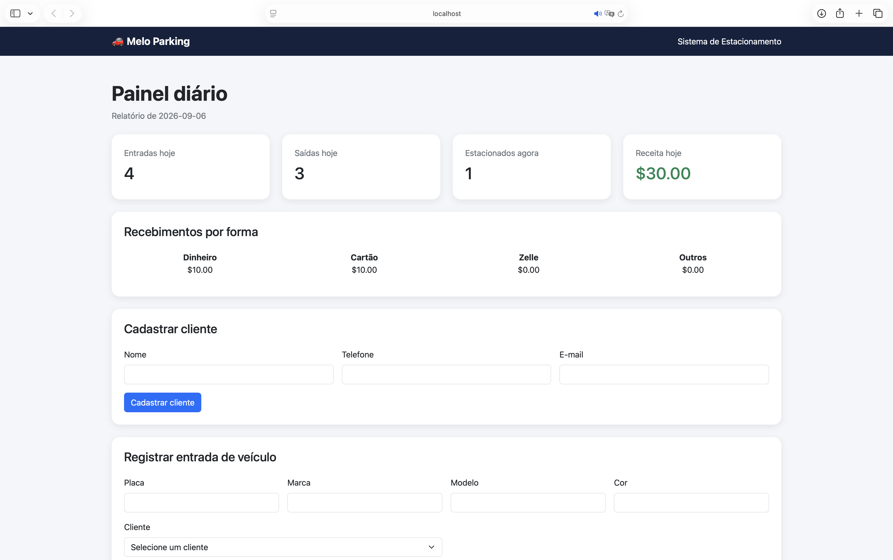

# Melo Parking

## Live Demo

🚀 [Open Melo Parking](https://melo-parking.onrender.com)

> The free hosting instance may take up to 60 seconds to start after a period of inactivity.

## Interface



Melo Parking is a full-stack parking management system built with
C#, .NET, PostgreSQL, Entity Framework Core, JavaScript, and Bootstrap.

The application manages customers, vehicle check-ins, check-outs,
parking fees, payment methods, and daily financial reports.

## Features

- Customer registration
- Vehicle check-in
- Vehicle check-out
- Automatic parking fee calculation
- Payment methods:
  - Cash
  - Card
  - Zelle
  - Other
- Prevention of duplicate active check-ins
- Returning vehicle support
- Daily revenue report
- Revenue totals by payment method
- Responsive Bootstrap dashboard
- Persistent PostgreSQL database

## Technologies

- C#
- .NET 10
- ASP.NET Core Minimal API
- Entity Framework Core
- PostgreSQL
- HTML5
- JavaScript
- Bootstrap 5
- Git

## Project Structure

```text
EstacionamentoAPI/
├── Data/
│   └── AppDbContext.cs
├── Models/
│   ├── Cliente.cs
│   ├── Veiculo.cs
│   └── SaidaRequest.cs
├── Migrations/
├── wwwroot/
│   └── index.html
├── Program.cs
├── appsettings.json
└── EstacionamentoAPI.csproj

Main API Endpoints
| Method | Endpoint                                     | Description                     |
| ------ | -------------------------------------------- | ------------------------------- |
| GET    | `/clientes`                                  | Lists customers                 |
| POST   | `/clientes`                                  | Creates a customer              |
| GET    | `/veiculos`                                  | Lists vehicle records           |
| POST   | `/veiculos`                                  | Registers a vehicle check-in    |
| POST   | `/veiculos/{id}/saida`                       | Registers check-out and payment |
| PATCH  | `/veiculos/{vehicleId}/cliente/{customerId}` | Associates a customer           |
| GET    | `/relatorios/diario`                         | Returns the daily report        |

Running Locally
Requirements
.NET 10 SDK
PostgreSQL
Entity Framework Core CLI

Database
Create the PostgreSQL database:
createdb estacionamento_db
Create appsettings.Development.json with your local connection:
{
  "ConnectionStrings": {
    "DefaultConnection": "Host=localhost;Port=5432;Database=estacionamento_db;Username=YOUR_USERNAME"
  }
}
Apply the migrations:
dotnet ef database update
Start the application:
dotnet run
Open the dashboard:
http://localhost:5108
Business Rules
A vehicle cannot have two active check-ins simultaneously.
A returning vehicle can be checked in after its previous check-out.
Parking is charged by the hour.
The minimum charge is one hour.
All timestamps are stored in UTC.
Daily reports use the America/New_York time zone.
Author
Vinicius Melo
Computer Science graduate focused on software development and
full-stack web applications.